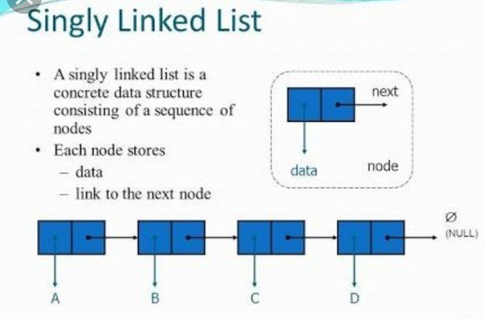

# Singly Linked List
Ngược lại với [Array](../../1.%20Array/)
- ƯU ĐIỂM: 
    + Việc thêm, xoá đơn giản chỉ cần thay đổi mối liên kết giữa các node với nhau
    + Không cần biết trước số lượng phần tử
    + Các phần không cần nằm liên tiếp nhau trong bộ nhớ máy tính ==> khắc phục được phân mảnh bộ nhớ
- NHƯỢC ĐIỂM:
    + Không thể truy vấn đến từ phần tử thông qua toán tử chỉ số, mà nó phải duyệt tuần tự thông qua các phần tử khác
    + Tốn bộ nhớ - chứa thêm con trỏ -> liên kết giữa các node với nhau
- [Code build lại SLL](./Ly_thuyet/)

|Hình minh hoạ|
|:---:|
||