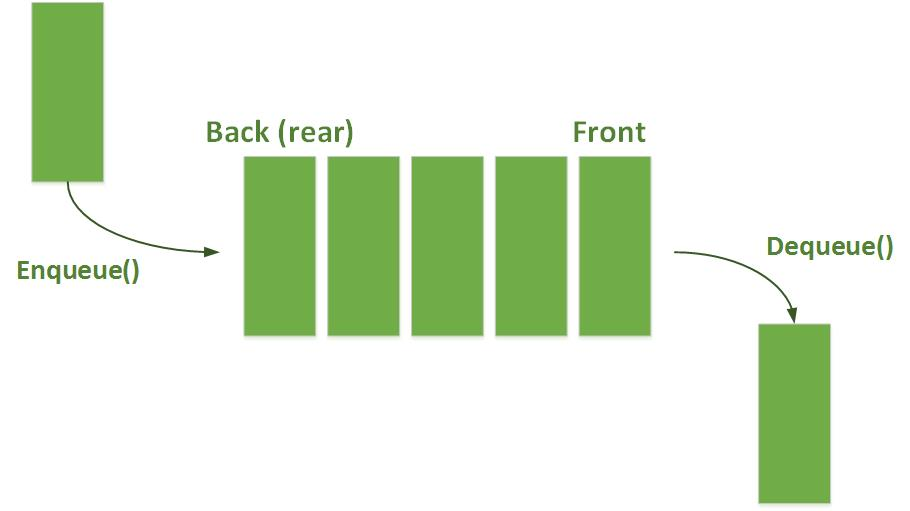

# Queue
- Làm việc theo cơ chế FIFO (first in first out): vào trước ra trước -> tưởng tượng giống việc xếp hàng
- Thao tác:
	+ empty: kiểm tra xem stack có rỗng hay không
	+ push: thêm 1 phần tử vào cuối Queue <=> theo cơ chế FIFO
	+ pop: xoá phần đầu queue
	+ front: xem thông tin của phần tử đầu danh sách và không huỷ
	+ back: xem thông tin của phần tử cuối danh sách và không huỷ
	+ size: xem số lượng phần tử
- [Code build lại queue](Ly_thuyet/Queue.hpp)

|Hình minh hoạ|
|:---:|
