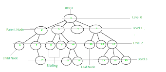
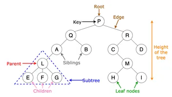

# Tree
- Khái niệm:
  - **Root**: gốc của tree
  - **Edge/branch/link**: dùng để biểu hiện sự liên kết của 2 cái node với nhau
  - **Leaf**: là node mà không có node con (không liên kết tiếp các node)
  - Sibling: những node có cùng node parent được gọi là node anh em
  - Ancestor, descendant: bắt buộc phải được liên kêt bởi Edge và nằm cùng 1 đường
    - Ancestor (tổ tiên)
    - descendant (con cháu)
  - Level: cấp độ của tree 
  - Depth: độ sâu của 1 node. Tính từ Root cho tới node đấy
  - Height: 
    - **Chiều cao của 1 node**. Tính từ node đó đến node thấp nhất
    - **Chiều cao của tree**. Tính từ Root đến node thấp nhất (Nếu chỉ có 1 root thì height của tree = 0)
  - Size: size của 1 node = tổng các node con cháu (descendant) + chính nó
  - Skew tree: nếu tree có mỗi cái node có 1 thằng con (hình 3)

|Hình 1|
|:---:|
||

|Hình 2|
|:---:|
||

|Hình 3|
|:---:|
||